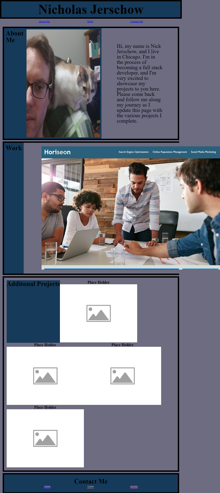

# Challenge-Second-Week

## Description
This is a professional portfolio designed for me, Nick Jerschow, to display my projects as I complete them throguhout the bootcamp. It is intended to be a starting poitn that is to be updating and refined throughout the program and my career to display my ongoing learning process. I have very far to go in that regard so you will find many changes in the coming months and beyond.

I ran out of time making this for the initial deadline. I'm not happy with it so I plan to resubmit. Possibly restartign over with the css layout.

## Installation

## Usage
This webpage is intended to be a portfolio to showcase my projects. It is also a place where interested parties can find my contact information.

## Credits
Place holder images were downloaded from https://archive.org/details/placeholder-image